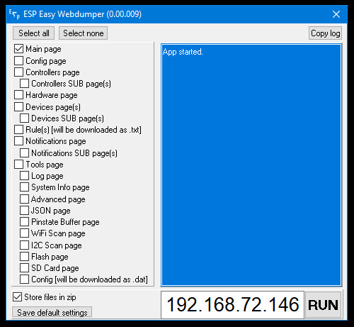

ESP Easy Webdumper
------------



INTRO
------------
**ESP Easy Webdumper** is originally a application to do screenshots of the ESP Easy web GUI for the wiki. I made it since the web interface is constantly changing and keeping up with the screenshots was getting more challenging when the project expands. Its a fun problem to overcome.

You may use this tool for getting screenshots of your unit to be uploaded to the forum if you need help. A screenshot is a perfect start when trying to explain your problem and for other community members to see what you may have done wrong or need to be aware off. A nice side effect of the tool is that these screenshots and downloads of the rules and config files are a great way of keeping backups for your units.

FEATURES
------------
```diff
+ Screenshot all pages, including subpages
+ Download all rule files
+ Download the config.dat file
+ Batch run multiple IP addresses (via batch file and command line switch /IP_NUMBER)
+ Batch run scheadule for daily or weekly backups (via batch file and command line switch /IP_NUMBER)
- Compress results into a zip file
```

EXTRA INFORMATION
------------
* **ONLY WINDOWS** is supported (Windows 10, Windows 8.1, Windows 8, Windows 7, and possibly older versions as well)
* **APP_DATA.zip** is needed for the screenshots, download and place it in the same directory as the ESP Easy Webdumper exe file.
* **Log files** for each webdump will be placed in the Log folder under the subfolder of that unit.
* **Batch mode** is possible using a batch file and call the application with this switch: "**ESP.Easy.Webdumper.exe /IP_NUMBER=192.168.x.xx**". The app will exit once a dump is completed. If you want the small window to not show up during the batch mode you need to add "**/SILENT=1**" to the command line.

I plan add more features on a weekly basis. Thanks for all the feedback!


LEGEND
------------
```diff
+ Green is a feature already implemented
- Red is on the todo-list
```

DISCLAIMER
------------
* **GUI** is messed up on Windows 10 (at least) compared to Windows 7 (which I compile the exe on). I will try to fix this in future releases, BETA, but as of now I focus on the core function. The main problem comes from W10 willingness of showing the interface with zoom activated. Reverting it to 100% fixes some of the messiness.


